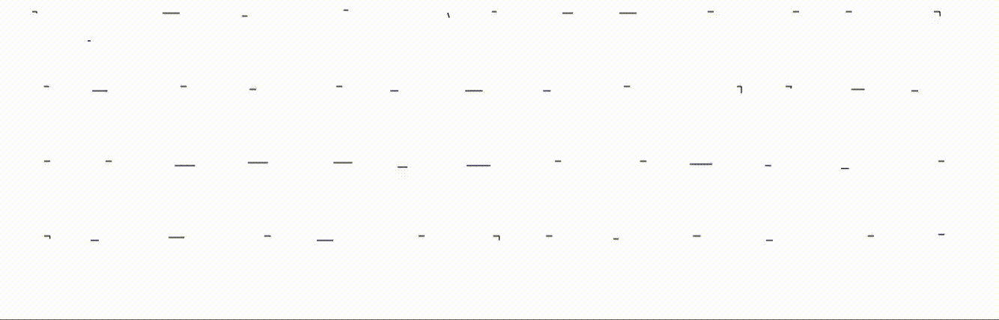
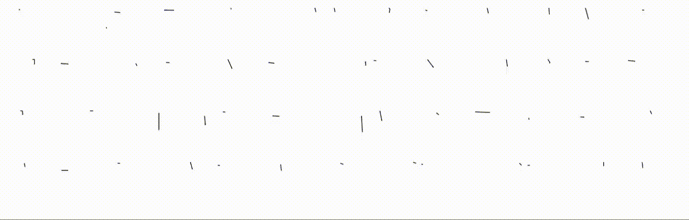

# DeepVecFont v2

This is the official pytorch implementation of:

DeepVecFont-v2: Exploiting Transformers to Synthesize Vector Fonts with Higher Quality. CVPR 2023.

Paper: [Arxiv](https://arxiv.org/abs/2303.14585) Video: [Youtube](https://www.youtube.com/watch?v=WZ_ech2Pxk0&t=1s&ab_channel=y)





## Installation

```
conda create -n dvf_v2 python=3.9
conda activate dvf_v2
pip install torch==1.13.1+cu117 torchvision==0.14.1+cu117 torchaudio==0.13.1 --extra-index-url https://download.pytorch.org/whl/cu117
pip install tensorboardX einops timm scikit-image cairosvg
```

## Dataset

The dataset used can be found in [Onedrive](https://1drv.ms/u/s!AkDQSKsmQQCghdBAA2WANQ3KcNV6uQ?e=p6NMIP) or [Baiduyun](https://pan.baidu.com/s/1zyVBDazvSVIAGnmHQHO1GA) (Password: pmr2). Put the `data` directory in the root path. This directory contains:

(1) `char_set`: the character set used for Chinese and English.
(2) `font_ttfs`: the TTF/OTF files of fonts.
(3) `font_sfds`: the sfd files extracted by FontForge.
(4) `vecfont_dataset`: the processed files ready for training/testing.

## Trained Checkpoints

Our trained checkpoints (English and Chinese) can be found in [Onedrive](https://1drv.ms/f/s!AkDQSKsmQQCghdBBraXUykrHbE2xHQ?e=xMA9xT) or [Baiduyun](https://pan.baidu.com/s/1e9GTjrHiSDOh6qPcrCZLHg) (Password: pih5). We provided 3 checkpoints on epochs 500, 550, 600.
If you use our trained checkpoints, you can directly go to the `Testing` section.

## Train

English Dataset:

```
CUDA_VISIBLE_DEVICES=0 python train.py --mode train --name_exp dvf_base_exp_eng --model_name main_model --batch_size 32 --max_seq_len 51 --lang eng --ref_nshot 4
```

Chinese Dataset:

```
CUDA_VISIBLE_DEVICES=0 python train.py --mode train --name_exp dvf_base_exp_chn --model_name main_model --batch_size 32 --max_seq_len 71 --lang chn --ref_nshot 8
```

## Testing (Few-shot Generation)
English:
```
CUDA_VISIBLE_DEVICES=0 python test_few_shot.py --mode test --name_exp dvf_base_exp_eng --model_name main_model --batch_size 1 --n_samples 20 --name_ckpt {name_ckpt}
```

Chinese:
```
CUDA_VISIBLE_DEVICES=0 python test_few_shot.py --mode test --name_exp dvf_base_exp_chn --language chn --max_seq_len 71 --model_name main_model --batch_size 1 --n_samples 50 --model_name main_model --batch_size 1 --n_samples 50 --ref_nshot 8 --ref_char_ids 0,1,2,3,26,27,28,29 --name_ckpt {name_ckpt}
```

Note that you can modify `ref_char_ids` to define which characters are used as references.
The synthesized candidates are in `./experiments/{exp_name}/results/{font_id}/svgs_single`, and the selected results (by IOU) is in `./experiments/{exp_name}/results/{font_id}/svgs_merge`.

In the testing phase, we run the model for `n_samples` times to generate multiple candidates, and in each time a random noise is injected (see [code](https://github.com/yizhiwang96/deepvecfont-v2/blob/c07d1d3a3a9ea491caecc879607c63d59aace1cd/models/transformers.py#L450)). 
Currently we use IOU as the metric to pick the candidate, which sometimes cannot find the best result. You can manually check all the candidates.

## Testing (Font interpolation and Random Generation)

Will be updated soon ...


## Customize Dataset

Taking --language 'eng' (English) as an example (it also could be 'chn' (Chinese)):

### Install Fontforge in non-Conda env:
```
conda deactivate
apt install python3-fontforge
```

###  Step1: Convert TTF to Sdfs
```
cd data_utils
python3 convert_ttf_to_sfd.py --split train --language eng
python3 convert_ttf_to_sfd.py --split test --language eng
```

By now you can re-enter the conda env:

```
conda activate dvf_v2
```

### Step2: Render glyph images:
```
python write_glyph_imgs.py --split train --language eng
python write_glyph_imgs.py --split test --language eng
```


### Step3: Filter and Package Them into Directories:

Modify `MAX_SEQ_LEN` (the maximum sequence length) in `svg_utils.py`. We set `MAX_SEQ_LEN` to `50` for English and `70` for Chinese. You can also change the number according to your need.

```
python write_data_to_dirs.py --split train --language eng
python write_data_to_dirs.py --split test --language eng
```


### Step3.1: Data Augmentation (ONLY for Chinese when training) 

```
python augment.py --split train --language chn --max_len 71
python augment.py --split test --language chn --max_len 71
```

### Step4: Relaxation Processing and Calculating Auxiliary Bezier Points:

```
python relax_rep.py --split train --language eng --max_len 51
python relax_rep.py --split test --language eng --max_len 51
```

when `language` is `chn`, set `max_len` to 71.


## Font Copyrights

Please note that all the Chinese fonts are collected from [Founder](https://www.foundertype.com/), and the fonts CANNOT be used for any commercial uses without permission from Founder.

## Acknowledgment

- [SVG-VAE](https://github.com/magenta/magenta/tree/main/magenta/models/svg_vae)
- [DeepVecFont](https://github.com/yizhiwang96/deepvecfont)


## Citation

If you use this code or find our work is helpful, please consider citing our work:
```
@inproceedings{wang2023deepvecfont,
  title={DeepVecFont-v2: Exploiting Transformers to Synthesize Vector Fonts with Higher Quality},
  author={Wang, Yuqing and Wang, Yizhi and Yu, Longhui and Zhu, Yuesheng and Lian, Zhouhui},
  booktitle={Proceedings of the IEEE/CVF Conference on Computer Vision and Pattern Recognition},
  pages={18320--18328},
  year={2023}
}
```